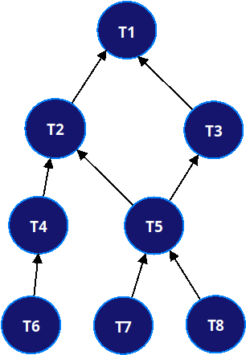

## UUP-BUILD-SYSTEM

A build system similar to make with complex dependency tree. Declare goals (target and dependencies)
and evaluate the dependency tree to rebuild targets in correct order.

Goals are **either** defined _programmatically in code_ or declared in _one or more make-files_. The remaining job for
users are to implement the target interface with some concrete actions.

### GETTING STARTED:

It's recommended to work with files, even though this README tries to completely describe both modes as simple as
possible.

#### GENERATE FILES

* Generate one or more make files using the `generate` option.
* Changing default namespace and add target classes.
* Notice that all target classes should return their name.

```shell
./vendor/bin/pbsmake generate > build.make
```

You can then use the make command (pbsmake) to evaluate targets. Use type=json if you prefer to work with JSON-style
files.

```shell
./vendor/bin/pbsmake generate=implicit type=json > build.json
./vendor/bin/pbsmake build.json
```

#### PROGRAMMATICALLY

* Begin by creating a dependency tree.
* Add one or more goal definitions. A goal definition consists of the target (code to run) and a list of dependencies.
* Get the node evaluator for complete tree or a child node.
* Call rebuild() to build that node, its dependencies and child nodes.

***Hint:***
The dependency tree can be obtained from a (make/json) file reader.

### TARGETS:

A [target](docs/targets.md) has a unique name and description as properties. The class provides the `isUpdated()` for
checking if a target is up-to-date and `rebuild()` to build it. The name is used for other targets to express their
dependency on this target.

### GOALS:

Goals are defined by its target and a list of zero or more dependencies. Dependencies are strings matching other
targets (goals) by their name. A goal is what's used for constructing the dependency tree.

### DECLARATIONS:

What, when & how everything should be build can either be declared programmatically in code, static declared with files
or a mixture of them.

### NODES & TREES:

The dependency tree can be constructed manually by adding child nodes (dependencies) and then using the node evaluator
on the root node for rebuilding the manual crafted tree. More convenient is to use the dependency tree, adding nodes to
it either as dependency nodes or using goal definitions.

### FILES:

Dependencies can be declared in text files which are consumed by a file reader. The same reader can be used for reading
rules from multiple input files:

```php
$reader = new MakeFileReader();

$reader->addDependencies("makefile1.txt");
$reader->addDependencies("makefile2.txt");

$reader->getDependencyTree()
       ->getEvaluator()
       ->rebuild();
```

Currently, [GNU makefile](example/file/input.make) or [JSON](example/file/input.json) is the supported file formats.

#### MAKEFILE

An example of makefile declaration is this:

```makefile
VERBOSE	:= true
DEBUG 	:= true

NAMESPACE := UUP\BuildSystem\Tests

T1 :
	Target("T1")
T2 : T1
	Target("T2")
T3 : T1
	Target("T3")
T4 : T2
	Target("T4")
T5 : T2 T3
	Target("T5")
T6 : T4
	Target("T6")
T7 : T5
	Target("T7")
T8 : T5
	Target("T8", 123, true)
```

As usual, the left-hand side is the rule target and right-hand side list dependencies. The Target class implements the
PHP code to execute for that rule target. The T5 target depends on T2 and T3, while T6 and T7 both depends on T5.

The target class will be constructed with variadic number of arguments. It's thus possible to use the same target class
in multiple rules and define different behavior from arguments. First argument will always be the target name followed
by any optional arguments:

```makefile
T1 :
	Target()            # Constructs new Target("T1"), were T1 is derived from target name.
T8 : T5
	Target(123, true)   # Constructs new Target("T8", 123, true) from target name with optional arguments.
```

In reality, the Target class will be replaced by different classes. This is just an example makefile purely for testing.

#### OPTIONS

Optional arguments are not limited to simple scalar values. Use standard JSON encoding for passing complex object
structures as optional arguments that will be decoded into standard associative arrays.

```makefile
T8 : T5
	Target(123, true, ["P1", "P2"])
T9 : T5
	Target(123, true, {"name": "Anders", "city": "Uppsala", "hobbies": ["playing guitar", "watching sci-fi", "programming"]})
```

#### NAMESPACES

The default namespace is declared in the makefile. If classes is placed in multiple namespaces, either declare them
fully qualified or split declarations in multiple file, each with their own default namespace.

#### IMPLICIT

Target classes can be deduced from make rule (in Makefile or JSON file). In this case, the left-/right-hand target
should be a class. The example Makefile above then becomes:

```makefile
VERBOSE	:= true
DEBUG 	:= true

NAMESPACE := UUP\BuildSystem\Tests\Implicit

T1 :
T2 : T1
T3 : T1
T4 : T2
T5 : T2 T3
T6 : T4
T7 : T5
T8 : T5
```

Each T* class is present in this test namespace and can be tested with:

```shell
./vendor/bin/pbsmake example/file/implicit.make target=T3
```

It's possible to mix rules with implicit/explicit target classes. Classes don't have to be defined in the namespace
declared in the make file, use fully qualified class name if present in some other namespace.

Implicit target will get the list of dependencies passed as constructor arguments. For example, the T5 class will be
constructed with ("T2", "T3") as constructor arguments.

#### PROBING

Invoking the pbsmake-command without a list of makefiles will cause script to probe current directory for some standard
named files: `build.make`, `build.json`, `makefile`, `makefile.txt` and `*.pbs`. The default type is assumed to be
makefiles.

Pass recursive option (-r) to enable recursive scan for makefiles starting in current directory.

#### VERBOSE & DEBUG

The superglobal environment (`$_ENV`) gets populated with DEBUG and VERBOSE values from make files.

```php
Array
(
    [PBS_MAKE_VERBOSE] => 1
    [PBS_MAKE_DEBUG] => 1
)
```

For convenience, either true/false, yes/no, on/off and 0/1 are recognised as boolean value.

#### PHONY TARGETS

Phony target function as virtual dependencies for zero or more real targets. It's easiest to explain this with an simple
example.

Let's say that we define this list of phony targets:

```makefile
PHONY := all clean dist-clean
```

We can then i.e. set T1 and T2 to depend on the phony `all` target:

```makefile
T1 : all
T2 : all
T3 : T1
T4 : T2
T5 : T2 T3
```

Evaluate the dependency tree starting from the builtin root-node will list:

```shell
./vendor/bin/pbsmake example/file/implicit.make -d target=root
  ...
Evaluate node tree structure (graph):
{
    "all": {
        "T1": {
            "T3": {
                "T5": []
            }
        },
        "T2": {
            "T4": [],
            "T5": []
        }
    },
    "clean": [],
    "dist-clean": []
}
  ...
```

As expected, both T1 and T2 are immediate child of the phony target `all`. Evaluating target all will rebuild both of
them along with their dependencies.

```shell
./vendor/bin/pbsmake example/file/implicit.make -v target=all
  ...
Add dependencies from example/file/implicit.make
Making all (Phony target for all)
  ...
```

**Notice:**

If `target` option isn't specified, then the builtin `root` target will be evaluated. In the example above, it will
cause `clean` and `dist-clean` to be evaluated too.

#### SPECIAL TARGETS

One common task is to execute shell commands. A builtin target exists for this:

```makefile
clean:
    Shell("find -name *.tmp -type f | xargs rm -f")
```

Wrap commands within `@(...)` or `@@(...)` to suppress output.

```makefile
clean:
    Shell("@(find -name *.tmp -type f | xargs rm -f)")
```

Another task is to run arbitrary PHP code. Supplied code will be executed using `eval()`, make sure to not use this
feature with external input.

```makefile
finished:
    Call("printf('Finished build at %s!\n', strftime('%c'));")
```

See the unit tests for further examples.

### EVALUATION:

The tree is usually completely rebuilt by evaluating its root node:

```php 
$tree->getEvaluator()->rebuild();
```

It's also possible to obtain one of the tree nodes from the registry and evaluate it:

```php
$tree->getRegistry()->getNode("T5")
    ->getEvaluator()
    ->rebuild();
```

### EXAMPLES:

The example directory contains some script for constructing an example build tree. Evaluating the T5 node should rebuild
T1, T2, T3, T5, T7 and T8 in that order (unless dependency node are already up-to-date).



Run them from command line:

```shell
php example/definition-tree.php
```

### EXCLUDE CHILD TARGETS:

The default is to build a target node with all its dependency and child nodes. For a
more [standard make mode](example/make-compat.php), building child nodes can be disabled:

```php
$tree->getEvaluator()->setRebuildChildren(false)->rebuild();
```

Then the output will be:

```text
++ Rebuild node T5:
Called isUpdated() on T1 (updated=0)
Called rebuild() on T1 (updated=0)
Called isUpdated() on T2 (updated=0)
Called rebuild() on T2 (updated=0)
Called isUpdated() on T3 (updated=0)
Called rebuild() on T3 (updated=0)
Called isUpdated() on T5 (updated=0)
Called rebuild() on T5 (updated=0)
++ Rebuild complete tree:
```

### MAKE COMMAND:

The make command [pbsmake](bin/pbsmake) can be used for executing makefiles and makes it easy to get started. Like
standard make, an optional target can be passed:

```shell
./vendor/bin/pbsmake example/file/input.make target=T8
Called isUpdated() on T1 (updated=0)
Called rebuild() on T1 (updated=0)
Called isUpdated() on T2 (updated=0)
Called rebuild() on T2 (updated=0)
Called isUpdated() on T3 (updated=0)
Called rebuild() on T3 (updated=0)
Called isUpdated() on T5 (updated=0)
Called rebuild() on T5 (updated=0)
Called isUpdated() on T7 (updated=0)
Called rebuild() on T7 (updated=0)
```

Multiple makefiles can be processed. Currently, a limitation is that all makefiles must be of same type.

```shell
./vendor/bin/pbsmake -h
PHP make (build system command)

Usage: pbsmake makefile1 [...makefiles] [target=name] [type=json]

Options:
  target=name:      Make this target.
  type=str:         The type of makefile (make/json).
  compat[=bool]:    Enable make compatible mode.
  generate[=mode]:  Output template makefile (explicit/implicit).
  recursive:        Recursive scan for makefiles (-r).

Generic options:
  help:     Show this casual help.
  version:  Show version information.
  verbose:  Run in verbose mode.
  quiet:    Run in quiet mode.
  debug:    Enable debug output.

Copyright (C) 2021-2022 Nowise Systems
```
